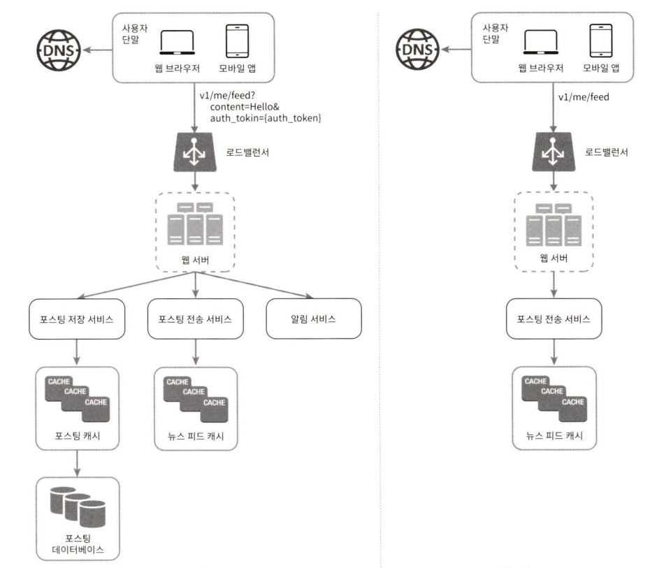

- 시스템 설계 면접은 모호하고, 지나치게 넓은 범위의 문제가 나올 수 있다

> “널리 알려진 제품 X를 설계해 보세요”
> 

⇒ 시스템 설계 면접은 두 명의 동료가 모호한 문제를 풀기 위해 협력하여 그 해결책을 찾아내는 과정에 대한 시뮬레이션이다

- 시스템 설계 면접의 목적(평가하려는 것)
    - 설계 기술을 시연할 것
    - 설계 과정에서 내린 결정들에 대한 방어 능력이 있는가?
    - 면접관의 피드백을 건설적인 방식으로 처리할 수 있는 자질이 있는가?
- 면접관의 관점
    - 지원자의 능력을 평가
    - 지원자의 설계 능력의 기술적 측면을 평가하는 것 뿐만 아니라 다른 자질도 평가
        - 협력에 강한 사람인가?
        - 압박이 심한 상황도 잘 헤쳐 나갈 자질이 있는가?
        - 모호한 문제를 건설적으로 해결할 능력이 있는가?
        - 좋은 질문을 던질 능력이 있는가?
        - 설계의 순수성(purity)에 집착해 타협적 결정(tradeoff)을 도외시하고 과도한 엔지니어링(over engineering)을 하지는 않는가?

## 3.1. 효과적 면접을 위한 4단계 접근법

### 3.1.1. [1단계] 문제 이해 및 설계 범위 확정

- 시스템 설계 면접 시, 생각 없이 바로 답을 내기보다 속도를 늦춰 깊이 생각하고 질문하여 요구사항을 완전히 이해하고 가정을 분명히 해야 한다
- 엔지니어가 가져야 할 가장 중요한 기술 중 하나:
    - 올바른 질문을 하는 것
    - 적절한 가정을 하는 것
    - 시스템 구축에 필요한 정보를 모으는 것
- 요구사항을 정확히 이해할 때 필요한 질문 예시
    - 구체적으로 어 떤 기능들을 만들어야 하나?
    - 제품 사용자 수는 얼마나 되나?
    - 회사의 규모는 얼마나 빨리 커지리라 예상하나? 석 달, 여섯 달, 일년 뒤의 규모는 얼마가 되리라 예상하는가?
    - 회사가 주로 사용하는 기술 스택(technology stack)은 무엇인가? 설계를 단순화하기 위해 활용할 수 있는 기존 서비스로는 어떤 것들이 있는가?
- **예제**
    - 요구: 뉴스 피드(news feed) 시스템을 설계하라
    - **지원자: 모바일 앱과 웹 앱 가운데 어느 쪽을 지원해야 하나요? 아니면 둘 다일까요?**
    - 면접관: 둘 다 지원해야 합니다.
    - **지원자: 가장 중요한 기능은 무엇인가요?**
    - 면접관: 새로운 포스트(post)를 올리고, 다른 친구의 뉴스 피드를 볼 수 있도록 하는 기능입니다.
    - **지원자: 이 뉴스 피드는 시간 역순으로 정렬되어야 하나요? 아니면 다른 특별한 정렬 기준이 있습니까? 제가 특별한 정렬 기준이 있느냐고 묻는 이유는, 피드에 올라갈 포스트마다 다른 가중치가 부여되어야 하는지 알고 싶어서 인데요. 가령 가까운 친구의 포스트가 사용자 그룹(user group)에 올라가는 포스트보다 더 중요하다거나.**
    - 면접관: 문제를 단순하게 만들기 위해, 일단 시간 역순으로 정렬된다고 가정합시다.
    - **지원자: 한 사용자는 최대 몇 명의 사용자와 친구를 맺을 수 있나요?**
    - 면접관: 5000명입니다.
    - **지원자: 사이트로 오는 트래픽 규모는 어느 정도입니까?**
    - 면접관: 일간 능동 사용자(daily active user, DAU)는 천만 명입니다.
    - **지원자: 피드에 이미지나 비디오도 올라올 수 있나요? 아니면 포스트는 그저 텍스트입니까?**
    - 면접관: 이미지나 비디오 같은 미디어 파일도 포스트 할 수 있어야 합니다.
    
    ⇒ 지원 환경, 주요 기능, 주요 기능인 피드의 정렬 기준, 주요 기능 중 친구 기능에서 최대 친구 수, 사이트로 오는 트래픽 규모, 데이터 형식 에 대해 질문
    

### 3.1.2. [2단계] 개략적인 설계안 제시 및 동의 구하기

- 설계안에 대한 최초 청사진을 제시 후, 팀원을 대하듯 면접관에게 의견을 구한다
- 화이트보드나 종이에 핵심 컴포넌트를 포함하는 다이어그램을 그리자 (클라이언트(모바일/웹), API, 웹 서버, 데이터 저장소, 캐시, CDN, 메시지 큐 등등)
- 최초 설계안이 시스템 규모에 관계된 제약사항들을 만족하는지를 개략적으로 계산해보자. 이 과정을 소리 내어 설명하고, 면접관에게 이런 추정이 필요한지 미리 물어보자
- 가능하다면 시스템의 구체적 사용 사례도 몇 가지 살펴보고 미처 고려하지 못한 에지 케이스(edge case)가 있는지 고려하자
- 이때 API 엔드포인트, 데이터베이스 스키마 등의 세부적인 백엔드적인 내용까지 설계해야 할 필요는 없겠지만 면접관의 의견을 물어보자
- 예제
    - 요구: 뉴스 피드(news feed) 시스템을 설계하라
    - 두 가지 처리 플로(flow)
        - 피드 발생(feed publishing): 사용자가 포스트를 올리면 관련된 데이터가 캐시 / 데이터베이스에 기록되고, 해당 사용자의 친구(friend) 뉴스 피드에 뜨게 된다
            
            → 왼쪽 그림 
            
        - 피드 생성(feed building): 어떤 사용자의 뉴스 피드는 해당 사용자 친구들의 포스트를 시간 역순으로 정렬하여 만든다
            
            → 오른쪽 그림
            
            
            

### 3.1.3. [3단계] 상세 설계

- 이 단계로 왔을 때, 달성한 상태인 목표들
    - 시스템 에서 전반적으로 달성해야 할 목표와 기능 범위 확인
    - 전체 설계의 개략적 청사진 마련
    - 해당 청사진에 대한 면접관의 의견 청취
    - 상세 설계에서 집중해야 할 영역들 확인
- 이제 면접관과 해야할 일 → 설계 대상 컴포넌트 사이의 우선순위를 정하는 것
    - 면접관과 함께 하는 만큼 직접 집중했으면 하는 영역을 알려주거나, 질문을 던질 수 있다
    - 대부분의 경우 특정 시스템 컴포넌트들의 세부사항을 깊이 있게 설명하는 것을 보길 원할 것이다
        - 예) 단축 URL 생성기 설계 → 그 해시 함수의 설계를 구체적으로 설명하는 것을 듣고 싶어할 것
        - 예) 채팅 시스템 설계 → 지연시간을 줄이고 사용자의 온/오프라인 상태를 표시할 것인지
- 사소하고 불필요한 세부사항을 설명하느라 능력을 다 보일 기회를 놓칠 수 있기 때문에 시간 관리에도 주의해야 한다
- 예제
    - 요구: 뉴스 피드(news feed) 시스템을 설계하라
    - 두 가지 중요한 용례에 대해 깊이 탐구
        1. 피드 출력
            
            → 상세 설계 
            
            
            
        2. 뉴스 피드 가져오기(news feed retrieval) 
            
            → 상세 설계 
            
            
            

### 3.1.4. [4단계] 마무리

- 설계 결과물에 관련한 후속 질문을 던지거나, 스스로 추가 논의를 진행하도록 할 수도 있다
- 활용할 수 있는 몇 가지 지침
    - 시스템 병목구간, 혹은 좀 더 개선할 지점을 찾아내라 (개선할 점이 없다는 답변은 X)
    - 설계를 다시 한 번 요약해주는 것도 도움이 될 수 있다
    - 오류가 발생하면 무슨 일이 생기는지(서버 오류, 네트워크 장애 등) 따져보면 흥미로울 것이다
    - 운영 이슈도 논의할 가치가 중분하다 (메트릭 수집 및 모니터링? 로그? 배포?)
    - 미래에 닥칠 확장 요구에 어떻게 대처할 것인가?
    - 시간이 좀 남았다면 필요하지만 다루지 못했던 세부적인 개선 사항들을 제안할 수 있따
- **면접 세션에서 해야 할 것**
    - 질문을 통해 확인하라(clarification). 스스로 내린 가정이 옳다 믿고 진행하지 말라.
    - 문제의 요구사항을 이해하라.
    - 정답이나 최선의 답안 같은 것은 없다는 점을 명심하라. 스타트업을 위한 설계안과 수백만 사용자를 지원해야 하는 중견 기업을 위한 설계안이 같을 리 없다. 요구사항을 정확하게 이해했는지 다시 확인하라.
    - 면접관이 여러분의 사고 흐름을 이해할 수 있도록 하라. 면접관과 소통하라.
    - 가능하다면 여러 해법을 함께 제시하라.
    - 개략적 설계에 면접관이 동의하면, 각 컴포넌트의 세부사항을 설명하기 시작하라. 가장 중요한 컴포넌트부터 진행하라.
    - 면접관의 아이디어를 이끌어 내라. 좋은 면접관은 여러분과 같은 팀원처럼 협력한다.
    - 포기하지 말라.
- **면접 세션에서 하지 말아야 할 것**
    - 전형적인 면접 문제들에도 대비하지 않은 상태에서 면접장에 가지 말라.
    - 요구사항이나 가정들을 분명히 하지 않은 상태에서 설계를 제시하지 말라.
    - 처음부터 특정 컴포넌트의 세부사항을 너무 깊이 설명하지 말라. 개략적 설계를 마친 뒤에 세부사항으로 나아가라.
    - 진행 중에 막혔다면, 힌트를 청하기를 주저하지 말라.
    - 다시 말하지만, 소통을 주저하지 말라. 침묵 속에 설계를 진행하지 말라.
    - 설계안을 내놓는 순간 면접이 끝난다고 생각하지 말라. 면접관이 끝났다고 말하기 전까지는 끝난 것이 아니다. 의견을 일찍, 그리고 자주 구하라.

### 시간 배분

- 보통 45~60분 정도로 충분하지 않을 수 있다
- 1 단계 - 문제 이해 및 설계 범위 확정: 3분에서 10분
- 2단계 - 개략적 설계안 제시 및 동의 구하기: 10분에서 15분
- 3단계 - 상세 설계: 10분에서 25분
- 4단계 - 마무리: 3분에서 5분