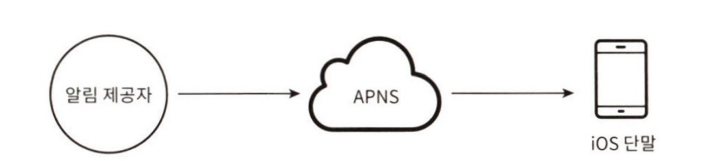

> 알림 시스템(notification system): 애플리케이션이 고객에게 중요할 만한 정보를 비동기적으로 제공하는 시스템
> 
> - 종류: 모바일 푸시 알림, SMS 메시지, 이메일

## 10.1. [1단계] 문제 이해 및 설계 범위 확정

- **지원자: 이 시스템은 어떤 종류의 알림을 지원해야 하나요?**
- 면접관: 푸시 알림, SMS 메시지, 그리고 이메일입니다.
- **지원자: 실시간(real-time) 시스템이어야 하나요?**
- 면접관: 연성 실시간(soft real-time) 시스템이라고 가정합니다. 알림은 가능한 한 빨리 전달되어야 하지만 시스템에 높은 부하가 걸렸을 때 약간의 지연은 무방합니다.
    - 연성 실시간(soft real-time) 시스템: 실시간 제약 조건을 지키는 것이 중요하지만 deadline으르 조금 어겨도 시스템 전체가 치명적으로 실패하지 않는 시스템
- **지원자: 어떤 종류의 단말을 지원해야 하나요?**
- 면접관: iOS 단말, 안드로이드(android) 단말, 그리고 랩톱/데스크톱을 지원해야 합니다.
- **지원자: 사용자에게 보낼 알림은 누가 만들 수 있나요?**
- 면접관: 클라이언트 애플리케이션 프로그램이 만들 수도 있구요. 서버 측에서 스케줄링 할 수도 있습니다.
- **지원자: 사용자가 알림을 받지 않도록(opt-out) 설정할 수도 있어야 하나요?**
- 면접관: 네. 해당 설정을 마친 사용자는 더 이상 알림을 받지 않습니다.
- **지원자: 하루에 몇 건의 알림을 보낼 수 있어야 하나요?**
- 면접관: 천만 건의 모바일 푸시 알림, 백만 건의 SMS 메시지, 5백만 건의 이메일을 보낼 수 있어야 합니다.

## 10.2. [2단계] 개략적 설계안 제시 및 동의 구하기

### 10.2.1. 알림 유형별 지원 방안

- **iOS 푸시 알림 알림 전송 메커니즘**
    
    
    
    - 알림 제공자(provider): 알림 요청(notification request)로 만들어 애플 푸시 알림 서비스(APNS)로 보내는 주체
        - 알림 요청을 만들기 위해 단말 토큰, 페이로드가 필요하다
            - 단말 토큰(device token): 알림 요청을 보내는 데 필요한 고유 식별자
            - 페이로드(payload): 알림 내용을 담은 JSON 딕셔너리(dictionary)
                
                ```json
                {
                		"aps": {
                						"alert": {
                						"title": "Game Request",
                						"body": "Bob wants to play chess",
                						"action-loc-key":"PLAY"
                				},
                				"badge":5
                		}
                }
                ```
                
    - APNS(Apple Push Notification Service): 애플이 제공하는 원격 서비스로 푸시 알림을 iOS 장치로 보내는 역할을 담당
    - iOS 단발(iOS device): 푸시 알림을 수신하는 사용자 단말
- **안드로이드 푸시 알림 전송 메커니즘**
    
    
    
    - iOS와 비슷한 절차
    - 차이점: 애플의 ANPS 대신 FCM(Firebase Cloud Messaging)을 사용
- **SMS 메시지 전송 메커니즘**
    
    
    
    - 제3사업자의 서비스를 주로 사용해 메시지 전송
        - 예) 트윌리오(Twilio), 넥스모(Nexmo)
- **이메일 전송 메커니즘**
    
    
    
    - 상용 이메일 서비스를 주로 사용해 메시지 전송
        - 예) 센드그리드(Sendgrid), 메일침프(Mailchimp)
        - 전송 성공률이 높고, 데이터 분석 서비스도 제공

- 모든 알림 유형을 한 시스템으로 묶은 이미지
    
    
    

### 10.2.2. 연락처 정보 수집 절차

- 알림을 보내기 위해서는 모바일 단말 토큰, 전화번호, 이메일 주소 등의 정보 필요
- 서비스에 대한 최초 사용자 등록 시 정보 수집 절차
    
    
    
- 연락처 정보 저장 테이블 구조
    - user: 이메일, 국가 코드, 전화번호
    - device: 단말 토큰
    - user, device 는 1:N관계
        
        → 한 사용자가 여러 단말을 가질 수 있고, 알림은 모든 단말에 전송되어야 한다
        
    
    
    

### 10.2.3. 알림 전송 및 수신 절차

- **개략적 설계안 (초안)**
    
    
    
    - 서비스 1~N: 마이크로서비스, 크론잡, 분산 시스템 컴포넌트와 같이 다양한 서비스를 가정한다
        - 예) 납기일 알림을 보내야 하는 과금 서비스, 배송 알림을 보내야 하는 쇼핑몰 웹사이트 등
    - 알림 시스템: 알림 전송/수신 처리의 핵심
        - 일단 1개의 서버만 사용한다고 가정
        - 서비스에게 알림 전송을 위한 API를 제공해야 하고, 제3자 서비스에 전달할 페이로드를 만들어 낼 수 있어야 한다
    - 제3자 서비스: 사용자에게 알림을 실제로 전달하는 역할
        - 서비스할 다양한 시장을 고려하여 확장성을 유의해야 한다 (쉽게 새로운 서비스 통합 or 기존 서비스 제거)
            - 예) FCM은 중국에서 사용하기 어려움. 중국에서는 제이푸시, 푸시와이 같은 별도의 서비스를 사용해야 함
    - 이 설계의 문제점:
        - SPOF(Single-Point-Of-Failure): 알림 서비스에 서버가 하나밖에 없을 경우, 그 서버에 장애가 생기면 전체 서비스의 장애로 이루어진다
        - 규모 확장성: 한 대 서비스로 푸시 알림에 관계된 모든 것을 처리한다 → 데이터베이스, 캐시 등 중요 컴포넌트의 규모를 개별적으로 늘릴 방법이 없다
        - 성능 병목: 특정 경우의 알림은 자원을 많이 필요로 할 수 있기 때문에 모든 경우를 하나의 서버로 처리하면 시스템이 과부하 상태가 될 수 있다
            - 예) HTML 페이지를 만들고 제3자 서비스의 응답을 기다리는 경우
- **개략적 설계한 (개선된 버전)**
    - 개선 방향:
        - 데이터베이스와 캐시를 알림 시스템의 주 서버에서 분리
        - 알림 서버 증설 및 자동 수평적 규모 확장이 이루어지도록 설계
        - 메시지 큐를 이용해 시스템 컴포넌트 사이의 강한 결합을 끊는다
    
    
    
    - 서비스 1~N: 알림 시스템 서버의 API를 통해 알림을 보낼 서비스
    - 알림 서버
        - 알림 전송 API: 스팸 방지를 위해 보통 사내 서비스 또는 인증된 클라이언트만 이용 가능
        - 알림 검증: 이메일 주소, 전화번호 등에 대한 기본적 검증 수행
        - 데이터베이스 또는 캐시 질의: 알림에 포함시킬 데이터를 가져오는 기능
        - 알림 전송: 알림 데이터를 메시지 큐에 넣는다
        - 예) 이메일 형태의 알림을 보내는 데 사용하는 API
            - `POST` `https://api.example,com/v/sms/send`
            - 전송할 데이터
                
                ```json
                {
                	"to":[
                		{
                			"user_id": 123456
                		}
                	],
                	"from": {
                		"email": "from_address@example.com"
                	},
                	"subject": "Hello, World!",
                	"content":[
                		{
                			"type": "text/plain",
                			"value": "Hello, World!"
                		}
                	]
                }
                ```
                
    - 캐시: 사용자 정보, 단말 정보, 알림 템플릿 등을 캐시
    - 데이터베이스: 사용자, 알림, 설정 등 다양한 정보 저장
    - 메시지 큐: 시스템 컴포넌트 간 의존성을 제거하기 위해 사용
        - 다량의 알림이 전송되어야 할 경우를 대비한 버퍼 역할을 하기도 한다
        - 이 설계에서는 알림의 종류별로 별도의 메시지 큐 사용
            
            → 서비스 중 하나 장애가 발생해도 나머지 종류의 알림은 정상 작동
            
    - 작업 서버: 메시지 큐에서 전송할 알림을 꺼내 제3자 서비스로 전달하는 역할

- **알림 전송 과정**
    1. API를 호출하여 알림 서버로 알림을 보낸다.
    2. 알림 서버는 사용자 정보, 단말 토큰, 알림 설정 같은 메타데이터(metadata)를 캐시나 데이터베이스에서 가져온다.
    3. 알림 서버는 전송할 알림에 맞는 이벤트를 만들어서 해당 이벤트를 위한 큐에 넣는다. 가령 iOS 푸시 알림 이벤트는 iOS 푸시 알림 큐에 넣어야 한다.
    4. 작업 서버는 메시지 큐에서 알림 이벤트를 꺼낸다.
    5. 작업 서버는 알림을 제3자 서비스로 보낸다.
    6. 제3자 서비스는 사용자 단말로 알림을 전송한다.

## 10.3. [3단계] 상세 설계

### 10.3.1. 안정성(reliability)

- **데이터 손실 방지**
    
    
    
    - 알림 시스템은 알림 데이터를 알림 로그 데이터베이스에 보관하고 재시도하는 메커니즘을 구현해야 한다
- **알림 중복 전송 방지**
    - 분산 시스템 특성상 가끔 같은 알림이 중복되어 전송될 수 있다
    - 중복 전송 빈도를 줄이기 위해 중복을 탐지하는 메커니즘을 도입하고, 오류를 신중히 처리해야 한다
    - 간단한 중복 방지 로직
        - 보내야 할 알림이 도착하면 그 이벤트 ID를 검사해 이전에 본 적 있는 이벤트인지 살핀다
        - 중복된 이벤트라면 버리고, 그렇지 않으면 알림을 발송한다

### 10.3.2. 추가로 필요한 컴포넌트 및 고려사항

- 알림 템플릿
    - 대형 알림 시스템의 알림 메시지는 대부분 형식이 비슷하기 때문에 알림 템플릿을 활용할 수 있다
    - 알림 템플릿: 인자(parameter), 스타일, 추적 링크(tracking link)를 조정하여 시전에 지정한 형식에 맞춰 알림을 만들어내는 틀
    - 예) 알림 템플릿 예시
        - 타이틀(CTA: Call to Action):
        지금 [item_name]을 주문 또는 예약하세요
        - 본문:
        여러분이 꿈꿔온 그 상품을 우리가 준비했습니다. [item_name]이 다시 입고
        되었습니다! [date]까지만 주문 가능합니다!
- 알림 설정
    - 서비스 상에서 사용자가 알림 설정을 상세히 조정할 수 있도록 한다
    - 알림 설정 테이블: 유저 별로 알림이 전송될 채널(푸시 알림, 이메일 등)과 해당 채널로 알림을 받을 것인지 여부를 저장하는 테이블
- 전송률 제한
    - 사용자가 알림 기능을 아예 꺼 버리는 것을 방지하기 위해 한 사용자가 받을 수 있는 알림의 빈도를 제한하는 것이 좋다
- 재시도 방법
    - 제3자 서비스가 알림 전송에 실패할 경우, 해당 알림을 재시도 전용 큐에 넣고 반복해서 문제가 발생할 경우 개발자에게 통지한다
- 푸시 알림과 보안
    - iOS, 안드로이드 앱이 사용하는 알림 전송 API는 appKey, appSecret을 사용해 보안을 유지한다
    - 즉, 인증되거나 승인된 클라이언트만 알림을 보낼 수 있다
- 큐 모니터링
    - 알림 시스템 모니터링 시, 중요한 메트릭 하나는 큐에 쌓인 알림의 개수
    - 너무 크면 작업 서버들이 이벤트를 빠르게 처리하고 있지 못하다는 것
        
        → 해결책: 작업 서버 증설
        
- 이벤트 추적
    - 사용자의 이벤트와 관련한 메트릭: 알림 확인율, 클릭율, 실제 앱 사용으로 이어지는 비율
    - 보통 알림 시스템을 만들 때, 데이터 분석 서비스에서 제공하는 이벤트 추적 기능과 통합한다
    - 예) 데이터 분석 서비스를 통해 추척하게 될 알림 시스템 이벤트 사례
        
        
        

### 10.3.3. 수정된 설계안


- 알림 서버에 인증과 전송률 제한 기능 추가
- 전송 실패에 대응하기 위한 재시도 기능 추가 (전송에 실패한 알림은 다시 큐에 넣고 지정된 횟수만큼 재시도)
- 전송 템플릿 사용
- 모니터링과 추적 시스템 추가