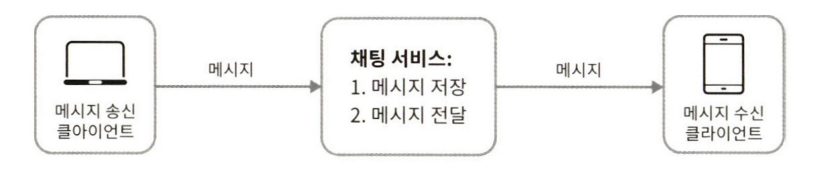

## 12.1. [1단계] 문제 이해 및 설계 범위 확정

- 어떤 채팅 앱을 설계하려는 것인가?
    - 1대1 채팅에 집중하는 경우: 페이스북 메신저, 위챗, 왓츠앱
    - 그룹 채팅에 집중하는 경우
        - 주로 업무용: 슬랙
        - 게임용: 디스코드 → 대규모 그룹의 소통과 응답지연이 낮은 음성 채팅에 집중
- 면접관과 질의 사례
    - **지원자: 어떤 앱을 설계해야 하나요? 1:1 채팅 앱입니까 아니면 그룹 채팅 앱입니까?**
    - 면접관: 둘 다 지원할 수 있어야 합니다.
    - **지원자: 모바일 앱 인가요 아니 면 웹 앱 인가요?**
    - 면접관: 둘 다입니다.
    - **지원자: 처리해야 하는 트래픽 규모는 어느 정도입니까?**
    - 면접관: 일별 능동 사용자 수(DAU: Daily Active User) 기준으로 5천만(50million) 명을 처리할 수 있어야 합니다.
    - **지원자: 그룹 채팅의 경우에 인원 제한이 있습니까?**
    - 면접관: 최대 100명까지 참가할 수 있습니다.
    - **지원자: 중요 기능으로는 어떤 것이 있을까요? 가령, 첨부파일도 지원할 수 있어야 하나요?**
    - 면접관: 1:1 채팅, 그룹 채팅, 사용자 접속상태 표시를 지원해야 합니다. 텍스트 메시지만 주고받을 수 있습니다.
    - **지원자: 메시지 길이에 제한이 있나요?**
    - 면접관: 네. 100,000자 이하여야 합니다.
    - **지원자: 종단 간 암호화(end-to-end encryption)를 지원해야 하나요?**
    - 면접관: 현재로서는 필요 없습니다만 시간이 허락하면 논의해볼 수 있겠습니다.
    - **지원자: 채팅 이력은 얼마나 오래 보관해야 할까요?**
    - 면접관: 영원히요
- 기능
    - 응답지연이 낮은 일대일 채팅 기능
    - 최대 100명까지 참여할 수 있는 그룹 채팅 기능
    - 사용자의 접속상태 표시 기능
    - 다양한 단말 지원. 하나의 계정으로 여러 단말에 동시 접속 지원
    - 푸시 알림
    - (+) 5천만 DAU 처리 가능

## 12.2. [2단계] 개략적 설계안 제시 및 동의 구하기

- 클라이언트는 서로 직접 통신하지 않는 대신, 위 모든 기능을 지원하는 채팅 서비스와 통신한다
- 기본 기능
    - 클라이언트들로부터 메시지 수신
    - 메시지 수신자(recipient) 결정 및 전달
    - 수신자가 접속(online) 상태가 아닌 경우에는 접속할 때까지 해당 메시지 보관
- (송신/수신) 클라이언트와 채팅 서비스 사이의 관계
    
    
    
    - 채팅을 시작하려는 클라이언트는 네트워크 통신 프로토콜을 사용해 서비스에 접속한다
        - 어떤 통신 프로토콜을 사용할 것인가?? → 면접관과 상의할 것
        - 클라이언트/서버 애플리케이션과 비유하자면 송신/수신 클라이언트가 클라이언트, 채팅 서비스가 서버인 셈이다
    - 클라이언트와 채팅 서비스는 HTTP 프로토콜을 사용해 연결한다
        - 많은 대중적 채팅 프로그램이 초기에 HTTP를 사용했다
        - Connection: keep-alive 헤더: 클라이언트와 서버 사이의 연결을 끊지 않고 계속 유지할 수 있고, TCP 접속 과정에서 발생하는 핸드셰이크 횟수를 줄일 수 있다
            - 기본적으로 HTTP는 요청에 대한 응답을 반환하면 연결이 끝나는데, 해당 헤더로 TCP 연결을 유지할 수 있는 것
        - HTTP는 클라이언트가 연결을 만드는 프로토콜이고, 서버에서 클라이언트로 임의 시점에 메시지를 보내는 데 쉽게 쓰일 수 없다
            - 서버가 먼저 새 메시지가 있다는 것을 알려줘야 하지만, 클라이언트가 먼저 요청하지 않으면 서버가 보낼 방법이 없는 것!
            - 서버가 연결을 만드는 것처럼 동작할 수 있게 하기 위한 기법이 필요
                
                → 폴랑, 롱 폴링, 웹소켓 등
                

### 12.2.1. 폴링(polling)

- 클라이언트가 주기적으로 서버에게 새 메시지가 있는지 물어보는 방법
- 문제점: 답해줄 메시지가 없는 경우 서버 자원이 불필요하게 낭비된다

### 12.2.2. 롱 폴링(long polling)

- 클라이언트가 새 메시지가 반환되거나 타임아웃 될 때까지 연결을 유지
- 약점:
    - 메시지를 보내는 클라이언트와 수신하는 클라이언트가 같은 채팅 서버에 접속하게 되지 않을 수 있다
        - HTTP 서버들은 보통 무상태 서버
        - 로드 밸런싱을 위해 라운드 로빈 알고리즘을 사용하는 경우, 두 클라이언트가 롱 폴링 연결을 갖고 있지 않은 서버일 수 있다는 것
            - 라운드 로빈 알고리즘: 들어오는 요청을 n개의 서버에 순환해서 배정하는 것 (1번 요청은 1번 서버, 2번 요청은 2번 서버 …)
    - 서버 입장에서는 클라이언트가 연결을 해제했는지 아닌지 알 만한 좋은 방법이 없다
        - 클라이언트가 갑자기 네트워크를 끊거나 앱을 종료해도 서버는 즉시 알 수 없고, TCP 연결이 완전히 끊어졌다는 신호가 오기 전까지 클라이언트가 살아있다고 생각하는 것
    - 여전히 비효율적이다

### 12.2.3. 웹소켓(WebSocket)

- 서버가 클라이언트에게 비동기(async) 메시지를 보낼 때 가장 널리 사용하는 기술
    - 웹소켓 연결은 클라이언트가 시작하고, 한 번 맺어진 연결은 항구적(영구적)이며 양방향이다
    - 처음에는 HTTP 연결이지만 특정 핸드셰이크 절차를 거쳐 웹소켓  연결로 업그레이드
    - 웹소켓 연결이 만들어진 뒤 서버에서 클라이언트로 비동기적으로 메시지 전송이 가능
- 80, 443 같은 HTTP, HTTPS 기본 포트 번호를 그대로 쓰기 때문에 방화벽이 있는 환경에서도 잘 동작

- 웹소켓 연결은 항구적으로 유지되어야 하기 때문에 서버 측에서 연결 관리를 효율적으로 해야 한다

### 12.2.4. 개략적 설계안

- 서비스 전체적으로 모두 웹소켓을 쓸 필요 없이 대부분의 기능(회원가입, 로그인 등)은 일반적인 HTTP 상에서 구현해도 된다
- 세 부분으로 나눠 보는 시스템
    
    
    
    1. 무상태 서비스
        - 이때 무상태 서비스는 로그인, 회원가입 등 채팅 외 대부분의 기능을 처리하는 전통적인 요청 및 응답 서비스
        - 서비스 탐색 서비스: 클라이언트가 접속할 채팅 서버의 DNS 호스트명을 클라이언트에게 알려주는 역할
    2. 상태 유지 서비스
        - 채팅 서비스는 클라이언트가 채팅 서버와 독립적인 네트워크 연결을 유지해야하기 때문에 상태 유지가 필요하다
    3. 제3자 서비스 연동
        - 푸시 알림 (→ 알림 시스템 설계 참고)
    4. 규모 확장성
        - 서버 한 대로 얼마나 많은 접속을 동시에 허용할 수 있느냐?
        - 이번 시스템은 동시 접속자가 1M이라고 가정
            
            → 접속당 10K의 서버 메모리가 필요하다고 볼 경우 10GB 메모리로 모든 연결을 다 처리할 수 있다
            
        - 하지만 서버 한 대로 모든 트래픽을 처리하는 것은 SPOF 등의 이유로 좋은 방법이 아니다
            - 하지만 처음에는 점차 다듬어나갈 생각으로 서버 한 대에 담은 설계안만 말하는 것은 괜찮다
- 개략적 설계안
    
    
    
    - 채팅 서버는 클라이언트 사이에 메시지를 중계하는 역할
    - 접속상태 서버(presence server)는 사용자의 접속 여부 관리
    - API 서버는 로그인, 회원가입, 프로파일 변경 등 그 외 나머지 전부를 처리
    - 알림 서버는 푸시 알림을 전송
    - 키-값 저장소에는 채팅 이력을 보관
- 저장소
    - 데이터 계층을 만들 때, 어떤 DB를 쓸지에 대한 질문에 답하기 위해 생각해볼 것은 **데이터의 유형**과 **읽기/쓰기 연산의 패턴**이다
    - 채팅 시스템이 다루는 데이터
        1. 사용자 프로필, 설정, 친구 목록 같은 일반적인 데이터
            - 안정성이 보장되는 관계형 데이터베이스에 보관
        2. 채팅 이력(chat history)
            - 읽기/쓰기 연산 패턴:
                - 방대한 채팅 이력 데이터 (페이스북 메신저, 왓츠앱은 매일 600억개의 메시지를 처리)
                - 대부분 오래된 메시지는 들여다 보지 않음
                - 간혹 검색 기능을 쓰거나 특정 사용자가 언급된 메시지를 보거나, 특정 메시지로 점프해서 무작위적인 데이터 접근을 하는 경우가 있으므로 지원할 필요가 있다
                - 1:1 채팅 앱의 경우 읽기:쓰기 비율은 1:1 정도
            - 키-값 저장소를 쓰는 것이 좋은 이유:
                - 쉬운 수평적 규모 확장
                - 낮은 데이터 접근 지연시간
                - 관계형 데이터베이스의 경우 데이터 가운데에 해당하는 부분을 잘 처리하지 못하는 경향이 있으며, 인덱스가 커지면 데이터에 대한 무작위적 접근을 처리하는 비용이 늘어남
                - 이미 많은 안정적인 채팅 시스템에서 채택한 방법 (페이스북 메신저 → HBase, 디스코드 → Cassandra)

### 12.2.4. 데이터 모델

- 1:1 채팅을 위한 메시지 테이블
    
    
    
    - 메시지 id(pk), 수신자, 송신자, 내용, 일시
- 그룹 채팅을 위한 메시지 테이블
    
    
    
    - 채널 id 및 메시지 id (pk, composite key), 수신자, 내용, 일시
    - 채널 id는 파티션 키로도 사용
- 메시지 ID
    - 조건:
        - message_id 값은 고유해야 한다 (uniqueness)
        - ID 값은 정렬 가능해야 하며 시간 순서와 일치해야 한다 → 새로운 ID는 이전 ID보다 큰 값이어야 한다
    - 방법:
        1. RDBMS 는 auto_increment 기능
            - 하지만 NoSQL은 보통 해당 기능을 제공하지 않는다 (다른 방법 필요)
        2. snowflake 같은 전역적 64-bit sequence number 생성기를 이용
        3. 지역적 순서 번호 생성기(local sequence number generator) 이용
            - 지역적: ID의 유일성은 같은 그룹 안에서만 보증하는 충분하다
            - 메시지 사이의 순서는 같은 채널, 1:1채팅 세션 안에서만 유지되면 충분하다

## 12.3. [3단계] 상세 설계

### 12.3.1. 서비스 탐색

- 서비스 탐색의 주 역할은 클라이언트에게 가장 적합한 채팅 서버를 추천하는 것이다
    - 기존: 클라이언트의 위치, 서버의 용량 등
    - 오픈 소스 솔루션: Apache Zookeeper

1. 사용자 A가 로그인 시도
2. 로드밸런서가 요청을 API 서버 중 하나로 전송
3. API 서버가 사용자 인증을 처리하고 나면 서비스 탐색 기능이 동작하여 해당 사용자를 서비스할 최적의 채팅 서버를 탐색 
4. 사용자 A는 반환된 채팅 서버에 접속해 웹소켓 연결을 맺음

### 12.3.2. 메시지 흐름

- **1:1 채팅 메시지 처리 흐름**
    
    
    
    1. 사용자 A가 채팅 서버 1로 메시지 전송
    2. 채팅 서버 1은 사용자 A가 보낸 메시지에 대해 ID 생성기를 통해 ID 결정
    3. 생성된 ID와 함께 메시지를 메시지 동기화 큐에 전송
    4. 메시지 동기화 큐는 키-값 저장소에 메시지를 보관
    5. 사용자 B의 접속 여부에 따른 분기
        1. 접속 중인 경우, 사용자 B가 접속 중인 채팅 서버 2로 메시지를 전송
        2. 미접속인 경우, 푸시 알림 메시지를 푸시 알림 서버로 전송(⇒사용자 B에게 알림 전송)
    6. 채팅 서버 2는 웹소켓 연결이 되어 있는 사용자 B에게 전송
- **여러 단말 사이의 메시지 동기화**
    
    
    
    - 이때 사용자 A는 전화와 랩톱 두 개의 단말을 이용한다
    - 사용자 A는 각각 로그인한 결과로 전화기, 랩톱 각각에서 채팅 서버 1과 웹소켓 연결이 만들어진 상황
    - 각 단말은 cur_max_message_id 라는 변수를 통해 해당 단말에서 관측된 최신 메시지의 ID를 추적한다
    - 새 메시지로 간주하는 기준:
        - 수신자 ID가 현재 로그인한 사용자 ID와 같다
        - 키-값 저장소에 보관된 메시지로서, 그 ID가 cur_max_message_id보다 크다
- **소규모 그룹 채팅에서의 메시지 흐름**
    - 사용자 A가 그룹 채팅 방에 메시지를 보냈을 때
        
        
        
        - 3명의 사용자가 있는 경우, 사용자 A가 보낸 메시지는 사용자 B, C의 메시지 동기화 큐에 복사된다
        - 소규모 채팅에 적합한 이유
            - 새로운 메시지가 온 경우 자기 큐만 보면 되기 때문에 메시지 동기화 플로가 단순해진다
            - 그룹이 크지 않으면 메시지를 수신자별로 복사해서 큐에 넣는 작업이 비용 측면에서 문제되지 않는다
        - 예) 위챗. 그룹의 크기를 500명으로 제한
    - 사용자 C가 사용자 A, B가 보낸 메시지를 수신할 때
        
        
        

### 12.3.3. 접속상태 표시

- 사용자의 접속 상태를 표시하는 것은 상당수 채팅 애플리케이션의 핵심 기능
- 접속상태 서버는 클라이언트와 웹소켓으로 통신하는 실시간 서비스의 일부
- **로그인, 로그아웃에 따라 상태가 바뀌는 시나리오**
    - **사용자 로그인**
        - 클라이언트와 실시간 서비스 사이에 웹소켓 연결이 맺어지고 나면 접속상태 서버는 A의 상태와 last_active_at 타임 스탬프 값을 키-값 저장소에 보관
            
            → 접속 중으로 표시 
            
        
        
        
    - **로그아웃**
        - 사용자가 로그아웃하면 API 서버는 접속상태 서버에 이 내용을 전달하고, 키-값 저장소에 보관된 사용자의 상태는 offline으로 변경
        
        
        
- **접속 장애**
    - 사용자의 인터넷 연결이 끊어질 경우 웹소켓 같은 지속성 연결도 끊어지는 문제가 생긴다
    - 장애에 대한 간단한 대응은 오프라인 상태로 표시 후, 복구되면 온라인 상태로 변경하는 것
        - 문제점: 짧은 시간 동안 인터넷 연결이 끊어졌다 복구되는 것은 흔하기 때문에 그 때마다 접속 상태를 변경하는 것은 과할 수 있고, 사용자 경험 측면에서도 바람직하지 않다
    - **박동(heartbreat) 검사**: 온라인 상태의 클라이언트로 주기적으로 박동 이벤트(heartbeat event)를 접속 상태 서버로 보내게 한다
        - 마지막 이벤트를 받은 지 x초 이내에 또 다른 박동 이벤트 메시지를 받으면 온라인으로 유지하고, 그렇지 않은 경우 오프라인으로 변경
    
    
    
- **상태 정보의 전송**
    
    
    
    - 상태정보 서버는 발행-구독 모델(publish-subscribe model) 사용
    - 사용자 A의 접속 상태가 변경된 경우 세 개의 채널(A-B, A-C, A-D)에 쓰고, 각각을 구독하는 사용자 B, C, D는 이 변화를 쉽게 통지 받을 수 있다
    - 그룹 크기가 작을 때 효과적인 방법
    - 그룹 크기가 커질 경우 접속상태 변화를 알릴 때 비용이나 시간이 많이 들게 된다
        - 예) 그룹 하나에 100,000명의 사용자가 있을 경우
            - 상태변화 1건당 100,000개의 이벤트 메시지가 발생한다
            - 이를 해결하기 위한 방법:
                - 사용자가 그룹 채팅에 입장하는 순간에만 상태 정보를 읽어가게 한다
                - 친구 리스트에 있는 사용자의 접속 상태를 갱신하고 싶으면 수동으로 하도록 유도한다